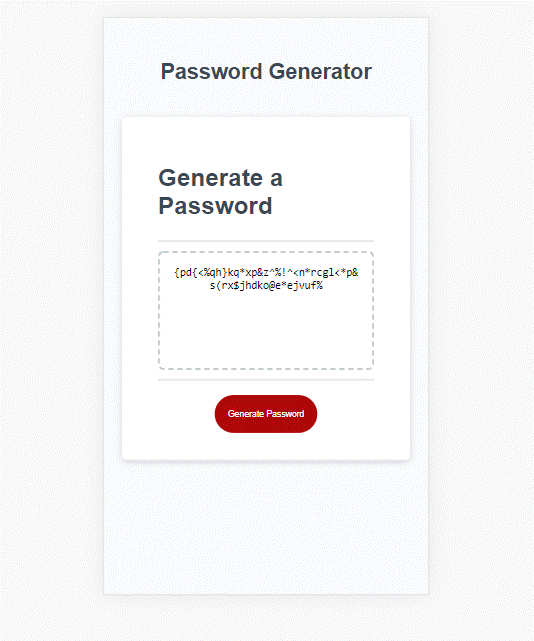

# Password Generator
```
The Password Generator is an application that enables employees to generate random passwords based on criteria that they’ve selected. It runs in the browser and features dynamically updated HTML and CSS powered by JavaScript. It has a responsive user interface that adapts to multiple screen sizes.
```

## Password Types

* The user can select any sized password from 8 to 128 characters.
* The character types can include any combination of:
** Upper cse letters
** Lower cse letters
** Numbers
** Special characters
One or more of the above types can be included in the password


## User Story

```
AS AN employee with access to sensitive data
I WANT to randomly generate a password that meets certain criteria
SO THAT I can create a strong password that provides greater security
```

## Acceptance Criteria

```
WHEN I click the button to generate a password
THEN I am presented with a series of prompts for password criteria

WHEN prompted for password criteria
THEN I select which criteria to include in the password

WHEN prompted for the length of the password
THEN I choose a length of at least 8 characters and no more than 128 characters

WHEN asked for character types to include in the password
THEN I confirm whether or not to include lowercase, uppercase, numeric, and/or special characters

WHEN I answer each prompt
THEN my input should be validated and at least one character type should be selected

WHEN all prompts are answered
THEN a password is generated that matches the selected criteria

WHEN the password is generated
THEN the password is either displayed in an alert or written to the page
```

## Image capture of the application
```
This image shows the application when it is ready to accept user input.  The user
clicks on the large red Generate Password button to receive prompts for the
desired input.
```


```
The next image shows the application's appearance and functionality after it 
has returned the requested password.  In this example, the Password Generator
was given user input requesting a password with length 50 characters, chosen
randomly from Special characters and Lowercase letters.
```



### Technical Acceptance Criteria: 40%

* Satisfies all of the preceding acceptance criteria plus the following:

  * The homework should not produce any errors in the console when you inspect it using Chrome DevTools.

### Deployment: 32%

* Application deployed at live URL.

* Application loads with no errors.

* Application GitHub URL submitted.

* GitHub repository that contains application code.

### Application Quality: 15%

* Application user experience is intuitive and easy to navigate.

* Application user interface style is clean and polished.

* Application resembles the mock-up functionality provided in the homework instructions.

### Repository Quality: 13%

* Repository has a unique name.

* Repository follows best practices for file structure and naming conventions.

* Repository follows best practices for class/id naming conventions, indentation, quality comments, etc.

* Repository contains multiple descriptive commit messages.

* Repository contains quality readme file with description, screenshot, and link to deployed application.

## Review

You are required to submit the following for review:

* The URL of the deployed application.

* The URL of the GitHub repository, with a unique name and a readme describing the project.

- - -
Chris Champness
